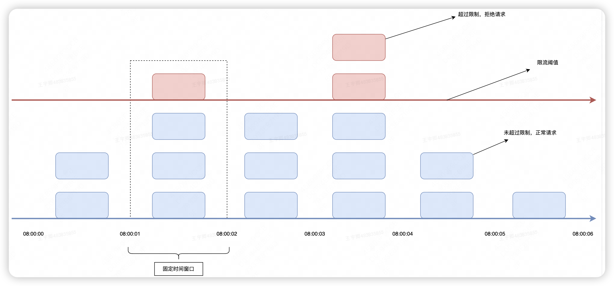
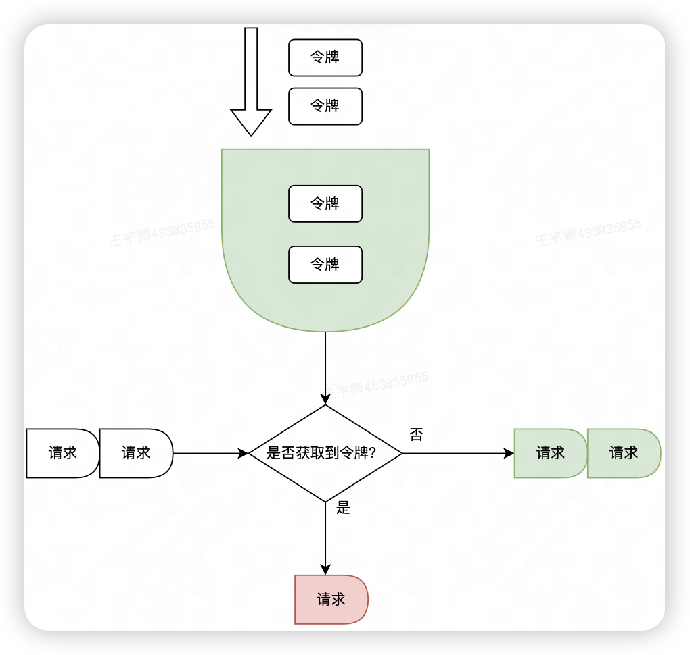

# 常见限流算法

限流是什么?

维基百科的概念如下：

In computer networks, rate limiting is used to control the rate of requests sent or received by a network interface controller. It can be used to prevent DoS attacks and limit web scraping

简单翻译一下：在计算机网络中，限流就是控制网络接口发送或接收请求的速率，它可防止DoS攻击和限制Web爬虫。

限流，也称流量控制。是指系统在面临高并发，或者大流量请求的情况下，限制新的请求对系统的访问，从而保证系统的稳定性。限流会导致部分用户请求处理不及时或者被拒，这就影响了用户体验。所以一般需要在系统稳定和用户体验之间平衡一下。举个生活的例子：

★ 一些热门的旅游景区，一般会对每日的旅游参观人数有限制的。每天只会卖出固定数目的门票，比如5000张。假设在五一、国庆假期，你去晚了，可能当天的票就已经卖完了，就无法进去游玩了。即使你进去了，排队也能排到你怀疑人生。”

常见的限流算法

# 固定窗口限流算法

首先维护一个计数器，将单位时间段当做一个窗口，计数器记录这个窗口接收请求的次数。

当次数少于限流阀值，就允许访问，并且计数器+1

当次数大于限流阀值，就拒绝访问。

当前的时间窗口过去之后，计数器清零。

假设单位时间是1秒，限流阀值为3。在单位时间1秒内，每来一个请求,计数器就加1，如果计数器累加的次数超过限流阀值3，后续的请求全部拒绝。等到1s结束后，计数器清0，重新开始计数。如下图：



伪代码如下：

```
/**
     * 固定窗口时间算法
     * @return
     */
    boolean fixedWindowsTryAcquire() {
        long currentTime = System.currentTimeMillis();  //获取系统当前时间
        if (currentTime - lastRequestTime > windowUnit) {  //检查是否在时间窗口内
            counter = 0;  // 计数器清0
            lastRequestTime = currentTime;  //开启新的时间窗口
        }
        if (counter < threshold) {  // 小于阀值
            counter++;  //计数器加1
            return true;
        }

        return false;
    }

```

但是，这种算法有一个很明显的临界问题：假设限流阀值为5个请求，单位时间窗口是1s,如果我们在单位时间内的前0.8-1s和1-1.2s，分别并发5个请求。虽然都没有超过阀值，但是如果算0.8-1.2s,则并发数高达10，已经超过单位时间1s不超过5阀值的定义啦。

# 令牌桶算法

令牌桶算法原理：

有一个令牌管理员，根据限流大小，定速往令牌桶里放令牌。

如果令牌数量满了，超过令牌桶容量的限制，那就丢弃。

系统在接受到一个用户请求时，都会先去令牌桶要一个令牌。如果拿到令牌，那么就处理这个请求的业务逻辑；

如果拿不到令牌，就直接拒绝这个请求。



漏桶算法伪代码实现如下：

```
    /**
     * 每秒处理数（放入令牌数量）
     */
    private long putTokenRate;
    
    /**
     * 最后刷新时间
     */
    private long refreshTime;

    /**
     * 令牌桶容量
     */
    private long capacity;
    
    /**
     * 当前桶内令牌数
     */
    private long currentToken = 0L;

    /**
     * 漏桶算法
     * @return
     */
    boolean tokenBucketTryAcquire() {

        long currentTime = System.currentTimeMillis();  //获取系统当前时间
        long generateToken = (currentTime - refreshTime) / 1000 * putTokenRate; //生成的令牌 =(当前时间-上次刷新时间)* 放入令牌的速率
        currentToken = Math.min(capacity, generateToken + currentToken); // 当前令牌数量 = 之前的桶内令牌数量+放入的令牌数量
        refreshTime = currentTime; // 刷新时间
        
        //桶里面还有令牌，请求正常处理
        if (currentToken > 0) {
            currentToken--; //令牌数量-1
            return true;
        }
        
        return false;
    }
```

如果令牌发放的策略正确，这个系统即不会被拖垮，也能提高机器的利用率。
